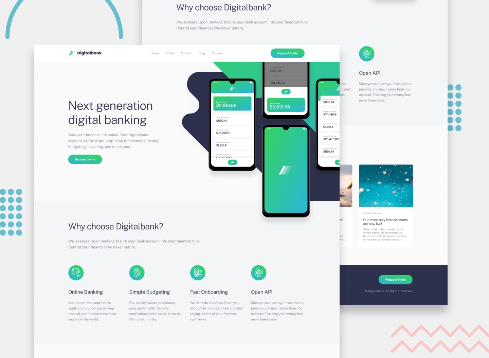

# Frontend Mentor - Digitalbank Landing Page Solution

This is my solution to the Digitalbank Landing Page Challenge on Frontend Mentor.  
The goal of this project was to create a responsive and modern landing page for a digital banking platform using **Vite** and **Tailwind CSS v4**.

---

## 🧭 Table of Contents
- [Overview](#overview)
  - [The Challenge](#the-challenge)
  - [Screenshot](#screenshot)
  - [Links](#links)
- [My Process](#my-process)
  - [Built With](#built-with)
  - [What I Learned](#what-i-learned)
  - [Continued Development](#continued-development)
  - [Useful Resources](#useful-resources)
- [Author](#author)
- [Acknowledgments](#acknowledgments)

---

## 🖼️ Overview

### The Challenge

Users should be able to:

- View the optimal layout for all devices (mobile, tablet, desktop)
- See smooth hover and focus states for interactive elements
- Navigate easily with a responsive menu
- Experience a fast and accessible landing page experience

### Screenshot

---

### Links

- **Solution URL:** [https://github.com/AbderrahmaneBouzemlal/digitalbank-landing-page](hhttps://github.com/AbderrahmaneBouzemlal/digitalbank-landing-page)
- **Live Site URL:** [https://digitalbank-landing-page-orcin.vercel.app/](https://digitalbank-landing-page-orcin.vercel.app/)

---

## ⚙️ My Process

### Built With

- **[Vite](https://vitejs.dev/)** – for lightning-fast development and build  
- **[Tailwind CSS v4](https://tailwindcss.com/)** – utility-first styling  
- **Semantic HTML5 markup**  
- **Flexbox** & **CSS Grid** for layout  
- **Mobile-first workflow**  
- **JavaScript (ES6)** for interactivity  

---

### 🧠 What I Learned

This project helped me understand how to efficiently combine **Vite** and **Tailwind CSS** for fast builds and modular styling.  
I also learned how to manage responsive layouts and reusable components using Tailwind’s utility classes.