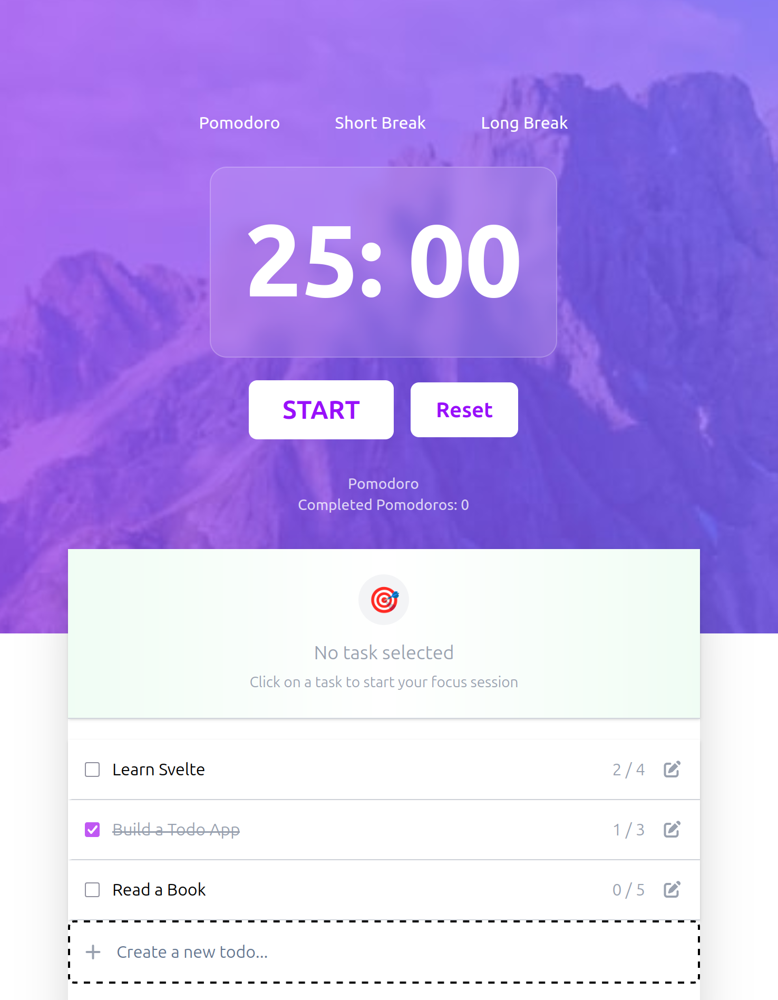

# svelte pomodoro timer app with todo list

## Table of contents

- [Overview](#overview)
  -[Quick start](#quick-start)
  - [The challenge](#the-challenge)
  - [Screenshot](#screenshot)
  - [Links](#links)
- [My process](#my-process)
  - [Built with](#built-with)
**Note: Delete this note and update the table of contents based on what sections you keep.**

## Overview

### Quick start
1. Clone the repo
2. Run `npm install`
3. Run `npm run dev` for a dev server.
4. Open `localhost:5173` in your browser.

### The challenge

Users should be able to:

- View the optimal layout for the app depending on their device's screen size
- See hover states for all interactive elements on the page
- Add new todos to the list
- Mark todos as complete
- Delete todos from the list
- Filter by all/active/complete todos
- Clear all completed todos
- pomodoro timer
- **Bonus**: Drag and drop to reorder items on the list (not done)

### Screenshot

### Built with

- Semantic HTML5 markup
- TailwindCSS custom properties
- Flexbox
- Mobile-first workflow
- [svelte](https://svelte.org/) - JS library
- [svelte-persistent-store]
- [svelte-dnd-action]

